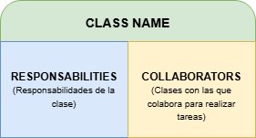
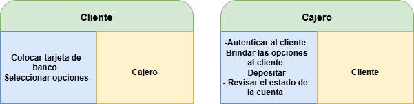

# Record, Organize and Refine Components

El diseño de software se puede representar mediante los siguientes pilares: Components, Responsabilities and Connections. (OJO: esto válido para la etapa de Conceptual Design).

Una de las técnicas más sólidas para representar qué hace cada clase se usa CRC Cards: Class, Responsability, Collaborator.

Estos ayudan a organizar los componentes en las clases, identificar las responsabilidades y cómo van a colaborar entre sí.

<figure><figcaption></figcaption></figure>

Uso de las CRC cards en la práctica

Supongamos el caso en el que tenemos un proyecto en el que hay que programar un cajero automático que permita realizar depósitos y&#x20;

<figure><figcaption></figcaption></figure>
