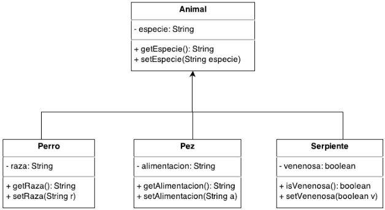
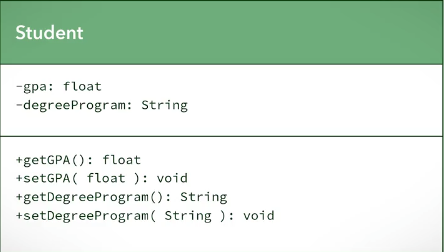

# Principios aplicados a UML Diagrams Java

### Abstracción aplicada en Diagrama de clase

CRC Cards sirven para un diseño de concepto del software, pero para la implementación se emplea Diagramas de Clase UML o DIagrama de Clase (Class Diagram).

Los Diagramas de Clase se traducen fácilmente en código. Se componen en 3 partes: Nombre de la clase, Atributos (nombre y tipo de dato) y Métodos (Funciones que harán los objetos dentro de la clase).

<figure><figcaption></figcaption></figure>

### Encapsulación aplicada en Diagrama de clase

Se coloca signo "-" para denotar que el atributo es privado y "+" si es público.


Se accede únicamente a los atributos privados desde la propia clase. Para poder controlar se usan métodos públicos (Get y Set) para poder manipular estos atributos, al colocarlos, tenemos más control sobre cuándo y cómo se manipulan los datos dentro de un objeto.


<figure><figcaption></figcaption></figure>

Getters: Métodos que permiten retornar información acerca de una clase.

Setters: Métodos que permiten colocar o cambiar información (en un atributo privado) de forma segura y protegida.

### Descomposición aplicada en Diagrama de clase
